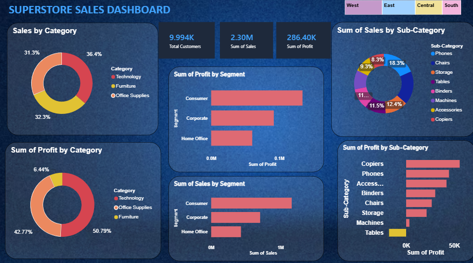
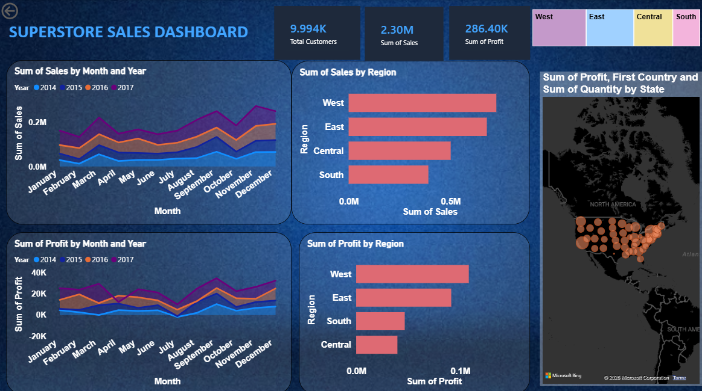

# 📊 Superstore Sales Dashboard | Power BI

An interactive Power BI dashboard built using the **Sample Superstore dataset (9,994 records)** to analyze sales, profit, customer segments, regional performance, and product categories through dynamic visualizations.

---

## 🚀 Features

- Interactive dashboard with Region slicer
- KPI Cards (Sales, Profit, Customers)
- Sales & Profit Analysis by Category
- Sales & Profit by Region
- Sales & Profit by Customer Segment
- Monthly Sales & Profit Trends (2014–2017)
- State-wise Sales Distribution Map
- Sub-Category Performance Analysis

---

## 📂 Dataset

- **Dataset:** Sample Superstore
- **Records:** 9,994
- **Columns:** 21

Key fields include:

- Order Date
- Customer
- Region
- Category
- Sub-Category
- Sales
- Profit
- Discount
- Quantity

---

## 🛠 Tools Used

- Power BI Desktop
- Power Query
- DAX
- Data Modeling

---

## 📈 Dashboard Preview

### Dashboard 1



### Dashboard 2



---

## 💡 Business Insights

- Technology generated the highest sales.
- Consumer segment contributed the most revenue.
- West region recorded the highest sales and profit.
- Monthly trends help identify seasonal sales patterns.
- Interactive filters allow region-wise analysis.

---

## 📁 Project Structure

```
Superstore-Sales-Dashboard/
│
├── Sales_project.pbix
├── Sample-Superstore.csv
├── Superstore Dashboard.pdf
├── Images/
│   ├── Dashboard_1.png
│   └── Dashboard_2.png
└── README.md

```

---

## 👩‍💻 Author

**Riya S Menon**


B.Tech CSE (AI & ML)


